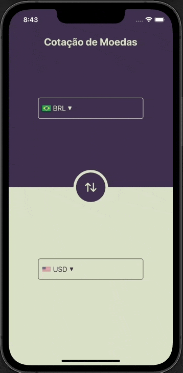

# Currency Converter

Projeto simples de criação de interface utilizando Swift com UIKit e View Code, este projeto inclui:

* Desenvolvimento de interface utilizando UIKit com View Code;
* Criação de structs;
* Criação de funções úteis como formatação de números para o formato de moeda brasileiro;
* Estruturação básica MVC;
* Requisições em webservice para a busca das moedas disponíveis, imagens das bandeiras, e função de conversão de moeda;
* Criação de Extensions de tipos já existentes;
* Conversão de imagem em base64 para UIImage;
* Utilização de Tables e Pickers para a seleção das moedas disponíveis;
* Aplicação de máscaras para estilização da interface;
* Modo Dark e Light com diferenças das cores das interface;

## Requisitos

- macOS 11 ou superior
- Xcode 12 ou superior
- Swift 5.3 ou superior
- Node.js 20

## WebService

Este projeto depende de um webservice que está disponível na pasta Server para a busca das moedas disponíveis e cálculo de conversão.

1. Após instalação e configuração do servidor Node.js, pelo terminal navegue até a pasta Server dentro do projeto Currency Converter
2. Rode o webService com o comando node index.js

# Projeto

Após iniciar o webservice, basta apenas rodar o aplicativo em um simulador ou dispositivo real que o consumo será feito automaticamente na url localhost:3210

## Imagens

|  |  |  |
|:---------------------------------------------:|:----------------------------------------:|:-----------------------------------------:|
|                 GIF de Funcionamento          |             Print Dark Mode              |              Print Light Mode             |

## Licença

Copyright (c) 2024 Fernando Schulz

Permission is hereby granted, free of charge, to any person obtaining a copy of this software and associated documentation files (the "Software"), to deal in the Software without restriction, including without limitation the rights to use, copy, modify, merge, publish, distribute, sublicense, and/or sell copies of the Software, and to permit persons to whom the Software is furnished to do so, subject to the following conditions:

The above copyright notice and this permission notice shall be included in all copies or substantial portions of the Software.

THE SOFTWARE IS PROVIDED "AS IS", WITHOUT WARRANTY OF ANY KIND, EXPRESS OR IMPLIED, INCLUDING BUT NOT LIMITED TO THE WARRANTIES OF MERCHANTABILITY, FITNESS FOR A PARTICULAR PURPOSE AND NONINFRINGEMENT. IN NO EVENT SHALL THE AUTHORS OR COPYRIGHT HOLDERS BE LIABLE FOR ANY CLAIM, DAMAGES OR OTHER LIABILITY, WHETHER IN AN ACTION OF CONTRACT, TORT OR OTHERWISE, ARISING FROM, OUT OF OR IN CONNECTION WITH THE SOFTWARE OR THE USE OR OTHER DEALINGS IN THE SOFTWARE.
